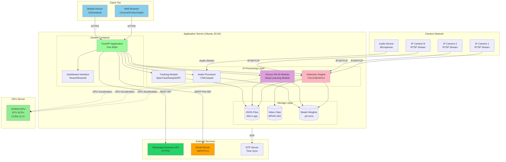

```mermaid
graph TB
    subgraph Client_Tier["Client Tier"]
        Browser[Web Browser<br/>Chrome/Firefox/Safari]
        Mobile[Mobile Device<br/>iOS/Android]
    end
    
    subgraph Application_Server["Application Server (Ubuntu 20.04)"]
        subgraph Docker_Container["Docker Container"]
            FastAPI[FastAPI Application<br/>Port 8000]
            Dashboard[Dashboard Interface<br/>React/Streamlit]
        end
        
        subgraph AI_Processing["AI Processing Layer"]
            Detection[Detection Engine<br/>YOLOv8/v9/v12]
            ReID[Person Re-ID Module<br/>Deep Learning Models]
            Audio[Audio Processor<br/>CNN-based]
            Tracker[Tracking Module<br/>ByteTrack/DeepSORT]
        end
        
        subgraph Storage_Layer["Storage Layer"]
            JSON[(JSON Files<br/>Alert Logs)]
            Videos[(Video Clips<br/>MP4/H.264)]
            Models[(Model Weights<br/>.pt/.onnx)]
        end
    end
    
    subgraph GPU_Server["GPU Server"]
        NVIDIA[NVIDIA GPU<br/>RTX 3070+<br/>CUDA 11.0+]
    end
    
    subgraph Camera_Network["Camera Network"]
        IPCam1[IP Camera 1<br/>RTSP Stream]
        IPCam2[IP Camera 2<br/>RTSP Stream]
        IPCam3[IP Camera N<br/>RTSP Stream]
        Mic[Audio Device<br/>Microphone]
    end
    
    subgraph External_Services["External Services"]
        WhatsApp[WhatsApp Business API<br/>HTTPS]
        SMTP[Email Server<br/>SMTP/TLS]
        NTP[NTP Server<br/>Time Sync]
    end
    
    Browser -->|HTTPS| FastAPI
    Mobile -->|HTTPS| FastAPI
    FastAPI --> Dashboard
    FastAPI --> Detection
    FastAPI --> ReID
    FastAPI --> Audio
    FastAPI --> Tracker
    
    Detection --> JSON
    Detection --> Videos
    ReID --> JSON
    Tracker --> JSON
    
    Detection -.->|GPU Acceleration| NVIDIA
    ReID -.->|GPU Acceleration| NVIDIA
    Audio -.->|GPU Acceleration| NVIDIA
    
    Detection --> Models
    ReID --> Models
    Audio --> Models
    
    IPCam1 -->|RTSP/TCP| Detection
    IPCam2 -->|RTSP/TCP| Detection
    IPCam3 -->|RTSP/TCP| Detection
    Mic -->|Audio Stream| Audio
    
    FastAPI -->|REST API| WhatsApp
    FastAPI -->|SMTP Port 587| SMTP
    Application_Server -->|NTP| NTP
    
    style Browser fill:#87CEEB
    style Mobile fill:#87CEEB
    style FastAPI fill:#98FB98
    style Detection fill:#FFB6C1
    style ReID fill:#DDA0DD
    style NVIDIA fill:#90EE90
    style WhatsApp fill:#25D366
    style SMTP fill:#FFA500
```